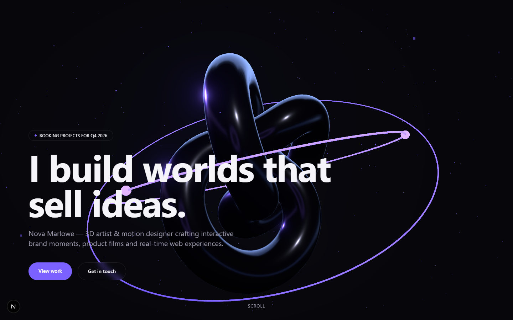
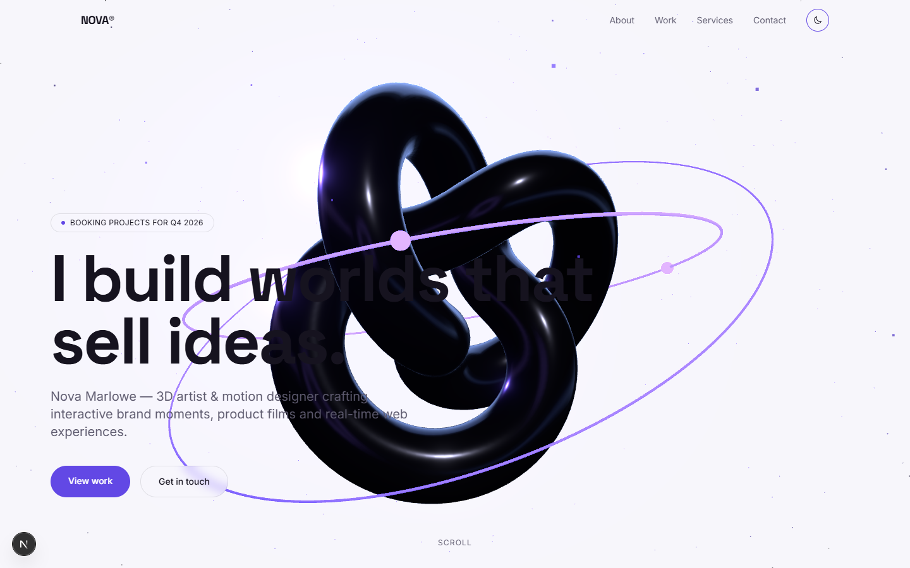
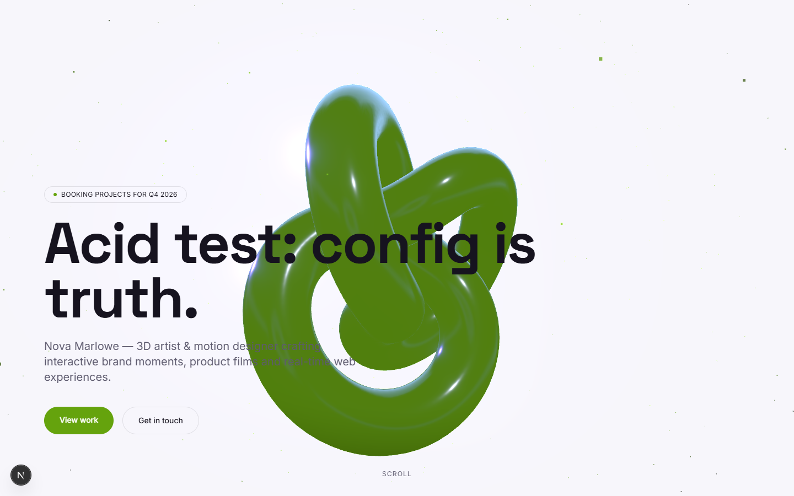

# ORBIT — Interactive 3D Portfolio Template

> ⚠️ **Not open source.** This repository is published as a public
> showcase. ORBIT is a **commercial template** — every use (personal,
> client, or commercial) requires a purchased license, and copying,
> reusing, redistributing or republishing the source is prohibited.
> See [LICENSE](LICENSE). © 2026 The ORBIT Authors, all rights
> reserved.

**One typed config. One stunning WebGL hero. An AI customization skill
included.** ORBIT is a premium portfolio template for designers,
3D artists and creative developers — built with Next.js 15, React
Three Fiber and Tailwind CSS 4, and customizable end-to-end from a
single file: `config/site.config.ts`.



## Why ORBIT

- **Config-driven everything.** Branding, colors, fonts, copy,
  projects, services, socials, SEO and the entire 3D scene live in one
  typed, Zod-validated config. Change a color → the whole site follows,
  including the WebGL glow.
- **A real 3D showpiece.** Scroll-choreographed hero (GSAP
  ScrollTrigger + R3F): camera dolly, model rotation, bloom — 60+ fps
  on desktop.
- **Swap the model with one path.** Drop a `.glb` into
  `public/models/`, point `hero.model.path` at it, done. Draco
  decoding ships locally; embedded animations auto-play.
- **AI-customizable by design.** Ships with a Claude Code skill and 8
  tested recipes (`skill/`) so an AI agent can rebrand, recolor,
  re-model and rewrite your site via chat — without breaking the scene.
- **Never janky.** Device tiers: full scene on desktop, lighter scene
  on mobile, a static poster for reduced-motion / no-WebGL visitors.
- **Production-grade.** TypeScript strict, ESLint 9, Lighthouse 100
  a11y / 100 SEO / 100 best practices, CLS 0, contact form with
  graceful no-key fallback.

| Dark | Light (toggle built in) |
| --- | --- |
|  |  |

## Quickstart (under 5 minutes)

```bash
npm install
npm run dev          # → http://localhost:3000
```

That's it — no API keys required for the full visual experience.
(The contact form falls back to a `mailto:` handoff until you add a
Resend key — see [SETUP.md](SETUP.md).)

## Customize

Everything is in **`config/site.config.ts`** — every field is
documented in `config/schema.ts`:

```ts
brand:    { name, tagline, logo },
theme:    { defaultMode, colors: { dark, light }, fonts, radius },
hero:     { headline, ctas, model, environment, lights, camera,
            postprocessing, particles, scroll, poster },
sections: [ about | work | services | contact ],   // order = page order
projects: [ ... ],   services: [ ... ],   socials: [ ... ],
contact:  { email, form },   seo: { title, description, ... }
```


*Same template — after editing only `site.config.ts` (mode, accent,
headline, hero model).*

### Customize with AI (the ORBIT skill)

Open the project in [Claude Code](https://claude.com/claude-code) and
just ask:

> "Rebrand this to my studio 'Atlas', dark green palette, swap the hero
> model to my `robot.glb` and make the copy more corporate."

The bundled skill (`skill/SKILL.md`, auto-discovered via
`.claude/skills/`) routes requests to 8 tested recipes — rebrand,
palette, model swap, projects, copy tone, sections, scene tuning,
fonts/mode — each with validation steps so the WebGL scene keeps
working. `CLAUDE.md` carries the golden rules.

### Swap the hero model by hand

```bash
npm run swap:model -- path/to/your-model.glb    # copies + prints config snippet
npm run optimize:model -- in.glb out.glb        # optional Draco (~85% smaller)
```

Prefer no model at all? `hero.model.path: null` renders the built-in
procedural showpiece (the chrome knot + glowing orbit rings).

## Scripts

| Script | What it does |
| --- | --- |
| `npm run dev` | Dev server (Turbopack) |
| `npm run build` / `start` | Production build / serve |
| `npm run typecheck` / `lint` / `format` | Quality gates |
| `npm run swap:model -- <file.glb>` | Install a hero model + config snippet |
| `npm run optimize:model -- <in> <out>` | Draco-compress a GLB |
| `npm run generate:model` | Regenerate the license-free demo GLB |

## Deploy

ORBIT deploys to [Vercel](https://vercel.com) untouched:

```bash
npx vercel
```

or push to GitHub → "Import Project" on vercel.com. Set
`RESEND_API_KEY` in the project's environment variables to activate
email delivery for the contact form. Details: [SETUP.md](SETUP.md).

## Structure

```
app/                  # App Router: layout (theme/font injection), page, /api/contact
components/three/     # R3F scene: canvas, model, particles, effects, env rigs
components/sections/  # Hero (scroll choreography), About, Work, Services, Contact
components/ui/        # Nav, footer, cards, form, reveals, theme toggle
config/               # schema.ts (Zod) + site.config.ts ← THE file you edit
lib/                  # theme CSS generator, font registry, icons, device tiers
public/models/        # GLB assets (+ /public/draco decoder)
skill/                # AI customization skill + 8 recipes
```

## Requirements & support

- Node 18.18+ (20+ recommended), npm 9+
- Browsers: evergreen Chrome/Edge/Firefox/Safari; WebGL2 for the 3D
  scene (others get the poster fallback automatically)
- Docs: [SETUP.md](SETUP.md) · [CLAUDE.md](CLAUDE.md) ·
  [skill/SKILL.md](skill/SKILL.md)

## License

Commercial template — see [LICENSE](LICENSE) (standard vs. extended
use). The demo content is fictional; the demo 3D model and all bundled
assets are original and license-free.
